# Polyglot Codebase Knowledge Graph

> Generated offline by **readmenator**. Supports C, C++, Python, Go, Rust, JS/TS, Java, C#, Shell, PHP, Dart, GDScript, Nim, ASM, Ruby, Swift, Kotlin, Scala, Lua, Elixir.
> No LLMs. No tokens. Pure static analysis. See more [here](https://github.com/grisuno/ReadMenator)

**Total Files Parsed:** 1 | **Total Symbols Extracted:** 1 | **Total Imports:** 8

<!-- ranking_model: v1.0 | weights: {ppr:0.45,auth:0.2,test:0.15,doc:0.1,fresh:0.1} | alpha:0.85 | commit:f0ae16d | date:2026-07-18 -->


## Table of Contents

1. [Statistics Dashboard](#statistics-dashboard)
2. [Architectural Layers](#architectural-layers)
3. [Ranked Context](#ranked-context)
4. [God Nodes](#god-nodes)
5. [Suggested Questions](#suggested-questions)
6. [Hotspot Analysis](#hotspot-analysis)
7. [Change Impact Analysis](#change-impact-analysis)
8. [Suggested Linting Rules](#suggested-linting-rules)
9. [Orphans](#orphans)
10. [Query Recipes](#query-recipes)
11. [Structural Knowledge Map](#structural-knowledge-map)
12. [UML Class Diagram](#uml-class-diagram)
13. [Code Property Graph](#code-property-graph)
14. [Architecture Reference](#architecture-reference)
    - [PY (1 files)](#py-1-files)

---

## Statistics Dashboard

| Metric | Value |
|--------|-------|
| Total Files | 1 |
| Total Symbols | 1 |
| Total Imports | 8 |
| Call Edges | 5 |
| Inheritance Edges | 0 |
| Languages | 1 |
| Avg Symbols/File | 1.0 |
| Avg Imports/File | 8.0 |

### Top Files by Import Count (Fan-Out)

| File | Imports | Symbols | Language |
|------|---------|---------|----------|
| `main.py` | 8 | 1 | py |

---

## Architectural Layers

Auto-detected from path patterns, naming conventions, and imported frameworks.

| Layer | Files |
|-------|-------|
| utility | 1 |

### utility

- `main.py` (py, 1 symbols)

---

## Ranked Context

Files ranked by composite score for the current query context. The ranking combines Personalized PageRank (query relevance), global authority, test coverage, documentation coverage, and code freshness. Model: v1.0.

| Rank | File | Composite | PPR | Authority | Test | Doc |
|------|------|-----------|-----|-----------|------|-----|
| 1 | `main.py` | 0.0000 | 0.0000 | 0.0000 | 0.00 | 0.00 |

---

## God Nodes

Most architecturally central files ranked by combined import/export degree and symbol richness.

| File | Score | Connections | PageRank |
|------|-------|-------------|----------|
| `main.py` | 0.1 | | 0.0000 |

---

## Suggested Questions

Auto-generated exploration prompts based on graph structure:

- What does main.py depend on, and what depends on it? (0 connections)
- What is the overall architecture of this codebase?

---

## Hotspot Analysis

Files ranked by combined complexity (symbol count) and centrality (connection count). High-scoring files are architecturally critical and may need refactoring attention.

| File | Complexity | Centrality | Combined | Symbols | Connections |
|------|-----------|------------|----------|---------|-------------|
| `main.py` | 1.000 | 1.000 | 1.000 | 1 | 8 |

---

## Change Impact Analysis

Files sorted by how many other files would be affected if they changed. High-impact files should be changed with caution.

| File | Direct Dependents | Transitive Dependents | Total Impact |
|------|------------------|----------------------|--------------|
| `main.py` | 0 | 0 | 0 |

---

## Suggested Linting Rules

Automatically suggested linting and security rules based on patterns detected in the codebase. These can be exported as Semgrep rules using the `--export-rules` flag.

| Rule ID | Severity | Description | Language | Matches |
|---------|----------|-------------|----------|---------|
| `RM001` | info | Print statement found (consider logging instead) | python | 5 |

---

## Orphans

Files with no documentation or low connectivity. These are candidates for documentation investment or cleanup.

- `main.py` (1 symbols, no doc)

---

## Query Recipes

Example queries you can run against this knowledge base using the ranking engine:

```
# Find files most relevant to a concept
readmenator query "Where is the import resolver implemented?"

# Rank files by relevance to a topic
readmenator query "How does documentation generation work?"

# Explain why a file ranks highly
readmenator query "explain readmenator/_documentation.py"

# Trace dependency paths with ranked context
readmenator query "path from CLI to exporter"
```

The ranking model uses the following signals:

- **Personalized PageRank** (45% weight): query-specific relevance via seed propagation
- **Global Authority** (20% weight): structural importance via standard PageRank
- **Test Coverage** (15% weight): fraction of symbols referenced in test files
- **Doc Coverage** (10% weight): presence of docstrings and file-level docs
- **Freshness** (10% weight): recent modification activity

Results include score decomposition and justification paths for each ranked item.

---

## Structural Knowledge Map

```mermaid
graph TD
    classDef mod fill:#1e1e1e,stroke:#ff6666,stroke-width:2px,color:#fff;
    classDef cls fill:#2d2d2d,stroke:#4ec9b0,stroke-width:2px,color:#fff;
    classDef fn fill:#333,stroke:#dcdcaa,stroke-width:1px,color:#dcdcaa;
    classDef ext fill:#111,stroke:#666,stroke-dasharray: 5 5,color:#aaa;
    main_py["main.py (py)"]
    class main_py mod;
    main_py_leer_texto_desde_pdf["leer_texto_desde_pdf"]
    class main_py_leer_texto_desde_pdf fn;
    main_py --> main_py_leer_texto_desde_pdf
    ext_pandas["pandas"]
    class ext_pandas ext;
    main_py -.->|imports| ext_pandas
    ext_numpy["numpy"]
    class ext_numpy ext;
    main_py -.->|imports| ext_numpy
    ext_tensorflow["tensorflow"]
    class ext_tensorflow ext;
    main_py -.->|imports| ext_tensorflow
    ext_tensorflow_keras["tensorflow.keras"]
    class ext_tensorflow_keras ext;
    main_py -.->|imports| ext_tensorflow_keras
    ext_PyPDF2["PyPDF2"]
    class ext_PyPDF2 ext;
    main_py -.->|imports| ext_PyPDF2
    ext_gensim["gensim"]
    class ext_gensim ext;
    main_py -.->|imports| ext_gensim
    ext_gensim_models["gensim.models"]
    class ext_gensim_models ext;
    main_py -.->|imports| ext_gensim_models
    ext_gensim_models_fasttext["gensim.models.fasttext"]
    class ext_gensim_models_fasttext ext;
    main_py -.->|imports| ext_gensim_models_fasttext
```



---

## Code Property Graph

Machine-readable Code Property Graph (CPG) in JSON-LD format. This block allows AI agents to parse the full structural graph without additional file reads. Compatible with GraphRAG pipelines.

```json
{"@context": "https://schema.org", "analysis": {"communities": [], "god_nodes": [{"node_id": "main.py", "score": 0.1}], "surprising_connections": []}, "edges": [{"confidence": "EXTRACTED", "relation": "imports", "source": "main.py", "target": "pandas"}, {"confidence": "EXTRACTED", "relation": "imports", "source": "main.py", "target": "numpy"}, {"confidence": "EXTRACTED", "relation": "imports", "source": "main.py", "target": "tensorflow"}, {"confidence": "EXTRACTED", "relation": "imports", "source": "main.py", "target": "tensorflow.keras"}, {"confidence": "EXTRACTED", "relation": "imports", "source": "main.py", "target": "PyPDF2"}, {"confidence": "EXTRACTED", "relation": "imports", "source": "main.py", "target": "gensim"}, {"confidence": "EXTRACTED", "relation": "imports", "source": "main.py", "target": "gensim.models"}, {"confidence": "EXTRACTED", "relation": "imports", "source": "main.py", "target": "gensim.models.fasttext"}], "generator": "readmenator", "metadata": {"edge_count": 13, "file_count": 1, "language_count": 1, "symbol_count": 1}, "nodes": [{"id": "main.py", "kind": "module", "label": "main.py", "language": "py", "sha256": "830094564a707ecd", "symbol_count": 1, "symbols": [{"kind": "function", "line": 13, "name": "leer_texto_desde_pdf", "signature": "def leer_texto_desde_pdf(ruta_archivo)"}]}], "type": "CodePropertyGraph", "version": "1.0"}
```

---

## Architecture Reference

### PY (1 files)

#### `main.py`
**Path:** `main.py`

**Functions:**
- `leer_texto_desde_pdf` (line 13) `def leer_texto_desde_pdf(ruta_archivo)`
