# Polyglot Codebase Knowledge Graph

> Generated offline by **readmenator**. Supports C, C++, Python, Go, Rust, JS/TS, Java, C#, Shell, PHP, Dart, GDScript, Nim, ASM.
> No LLMs. No tokens. Pure static analysis.

**Total Files Parsed:** 1 | **Total Symbols Extracted:** 1 | **Total Imports:** 8

## Structural Knowledge Map

```mermaid
graph TD
    classDef mod fill:#1e1e1e,stroke:#ff6666,stroke-width:2px,color:#fff;
    classDef cls fill:#2d2d2d,stroke:#4ec9b0,stroke-width:2px,color:#fff;
    classDef fn fill:#333,stroke:#dcdcaa,stroke-width:1px,color:#dcdcaa;
    classDef ext fill:#111,stroke:#666,stroke-dasharray: 5 5,color:#aaa;
    main_py["main.py (py)"]
    class main_py mod;
    main_py_leer_texto_desde_pdf["leer_texto_desde_pdf"]
    class main_py_leer_texto_desde_pdf fn;
    main_py --> main_py_leer_texto_desde_pdf
    ext_pandas["pandas"]
    class ext_pandas ext;
    main_py -.->|imports| ext_pandas
    ext_numpy["numpy"]
    class ext_numpy ext;
    main_py -.->|imports| ext_numpy
    ext_tensorflow["tensorflow"]
    class ext_tensorflow ext;
    main_py -.->|imports| ext_tensorflow
    ext_tensorflow_keras["tensorflow.keras"]
    class ext_tensorflow_keras ext;
    main_py -.->|imports| ext_tensorflow_keras
    ext_PyPDF2["PyPDF2"]
    class ext_PyPDF2 ext;
    main_py -.->|imports| ext_PyPDF2
    ext_gensim["gensim"]
    class ext_gensim ext;
    main_py -.->|imports| ext_gensim
    ext_gensim_models["gensim.models"]
    class ext_gensim_models ext;
    main_py -.->|imports| ext_gensim_models
    ext_gensim_models_fasttext["gensim.models.fasttext"]
    class ext_gensim_models_fasttext ext;
    main_py -.->|imports| ext_gensim_models_fasttext
```

---

## Architecture Reference

### PY (1 files)

#### `main.py`
**Path:** `main.py`

**Functions:**
- `leer_texto_desde_pdf` (line 13)
